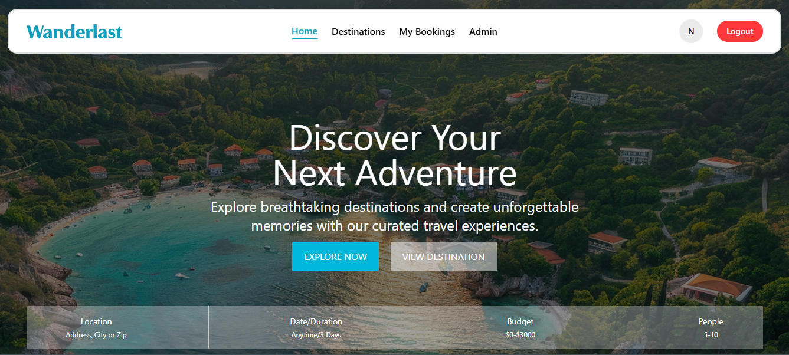
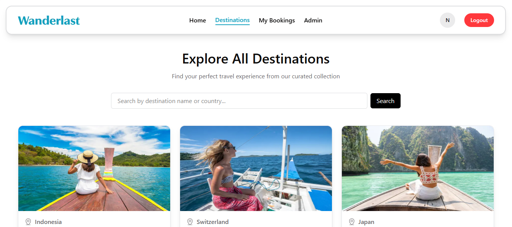
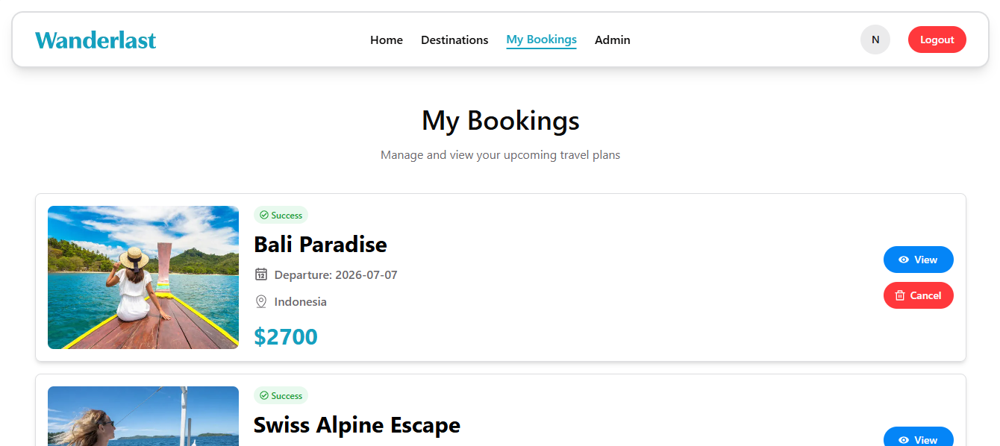
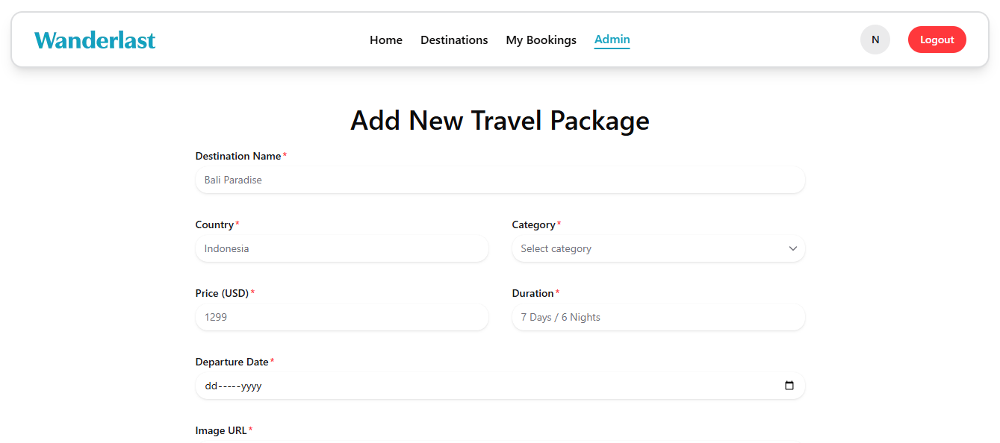
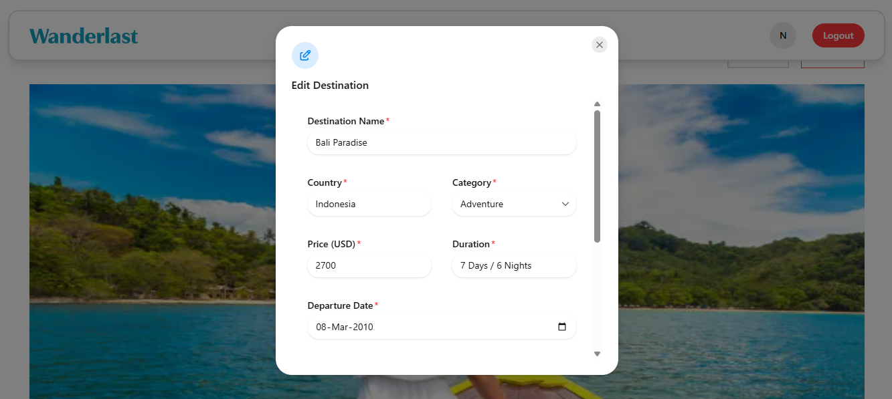
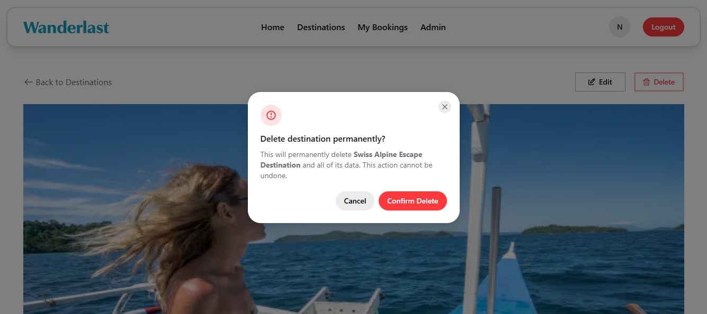

# 🌍 WonderLust - Travel Booking Platform

A modern and responsive travel booking web application where users can explore destinations and book amazing trips around the world.

---

## 🚀 Live Demo

👉 https://wanderlust-client-phi.vercel.app/

---

## 📸 Screenshots

##### Home

  

##### Destinations

  

##### My Booking

  

##### Admin

  

##### Edit Destination

  

##### Delete Destination

  

---

## 📖 Project Overview

WonderLast is a travel and tour booking platform designed to help users discover beautiful destinations, explore travel packages, and book trips easily through a modern user interface.

---

# ✨ Features

- 🌎 Explore popular travel destinations
- 📍 Detailed destination information page
- 🧳 Book trips easily
- 🔐 Authentication system
- 👤 Protected routes for authenticated users
- 📱 Fully responsive design
- ⚡ Fast and optimized performance
- 🎨 Modern UI/UX
- 🔄 Dynamic data fetching from API
- 📦 Reusable component architecture

---

# 🛠️ Technologies Used

## Frontend

- React.js
- Next.js
- JavaScript (ES6+)
- Tailwind CSS
- Hero UI
- React Icons

## Backend

- Node.js
- Express.js
- MongoDB

## Authentication

- Better Auth Authentication
- JWT Authentication
